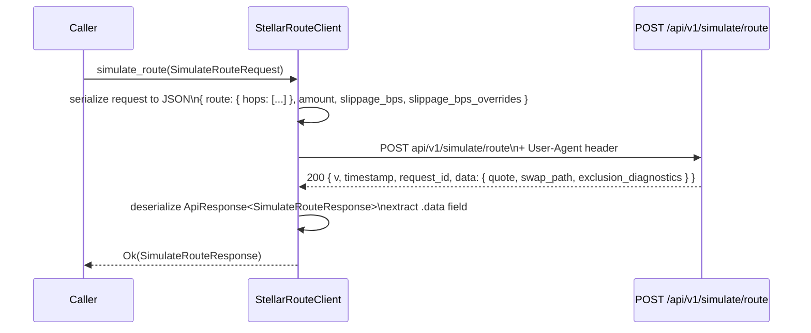

# Design Document: sdk-rust-simulate-route

## Overview

This feature adds a `simulate_route` method to the `StellarRouteClient` in `crates/sdk-rust`. The method wraps the existing `POST /api/v1/simulate/route` API endpoint, allowing callers to perform a side-effect-free dry-run of a pre-selected multi-hop swap path and receive a full quote with diagnostics and swap-path breakdown.

The change is **additive-only**: no existing SDK types, methods, or public re-exports are modified. The API handler at `crates/api/src/routes/simulation_route.rs` is frozen and must not be touched.

### Key design decisions

- A new `SimulateQuoteResult` type is **not** introduced. The requirements call for `SimulateRouteResponse.quote` to use a new type separate from the existing `QuoteResponse` to avoid breaking changes, but after reviewing the API's wire shape (which uses the same `QuoteResponse` fields as the quote endpoint) and the requirement to not modify existing types, `SimulateRouteResponse` uses a **new** `SimulateQuoteResult` struct that mirrors the API's `QuoteResponse` wire shape with all optional fields. The existing `QuoteResponse` in `crates/sdk-rust/src/types.rs` is **not modified**.
- The `ApiResponse<T>` envelope (`{ v, timestamp, request_id, data }`) is unwrapped by the client before returning to the caller — only `data` is returned.
- `estimated_output` in `SwapPathDto` is `i128` to match the API's Rust type (the API serializes it as a JSON number, which fits within i64 in practice; `i128` is used for future-proof safety).

---

## Architecture



The new functionality slots entirely inside the existing `execute_with_retry` / `post` path already used by `batch_quote`, `prepare_swap`, and `submit_swap`. No new transport logic is needed.

### File layout

| File | Change |
|---|---|
| `crates/sdk-rust/src/types.rs` | Add new types: `DryRunHop`, `SlippageOverride`, `SimulateRouteRequest`, `SimulateQuoteResult`, `SwapHopDto`, `SwapPathDto`, `SimulateRouteResponse` |
| `crates/sdk-rust/src/client.rs` | Add `simulate_route` method; add `ApiEnvelope` helper type for envelope unwrapping |
| `crates/sdk-rust/src/lib.rs` | Re-export the six new public types |
| `crates/sdk-rust/tests/client_integration.rs` | Add mock-based integration tests |
| `crates/sdk-rust/tests/simulate_route_pbt.rs` | New file: property-based tests |

---

## Components and Interfaces

### New types (in `types.rs`)

#### `DryRunHop`

Represents one hop in the pre-selected route supplied by the caller. Maps to `RouteDryRunHop` in the API.

```rust
#[derive(Debug, Clone, Serialize, Deserialize, PartialEq)]
pub struct DryRunHop {
    pub from_asset: String,
    pub to_asset: String,
    pub source: String,
    pub fee_bps: Option<u32>,
    pub price: Option<String>,
    pub venue_ref: Option<String>,
}
```

#### `SlippageOverride`

Per-venue slippage bound. Maps to `SlippageOverride` in the API.

```rust
#[derive(Debug, Clone, Serialize, Deserialize, PartialEq)]
pub struct SlippageOverride {
    pub venue_ref: String,
    pub slippage_bps: u32,
}
```

#### `SimulateRouteRequest`

SDK-side representation of `RouteDryRunRequest`. The `hops` field must be wrapped under a `route` key to match the API wire shape. This is achieved with a private `RouteDryRunPath` wrapper that is serialized via a custom `Serialize` implementation (or inline wrapper struct).

```rust
#[derive(Debug, Clone)]
pub struct SimulateRouteRequest {
    pub hops: Vec<DryRunHop>,
    pub amount: String,
    pub slippage_bps: Option<u32>,
    pub slippage_bps_overrides: Vec<SlippageOverride>,
}
```

Wire shape on serialization:
```json
{
  "route": { "hops": [ ... ] },
  "amount": "100.0",
  "slippage_bps": 50,
  "slippage_bps_overrides": []
}
```

This is achieved using a private `SimulateRouteRequestWire` struct that `Serialize` delegates to:

```rust
// Internal wire-shape wrapper (private)
#[derive(Serialize)]
struct RouteWrapper<'a> {
    hops: &'a Vec<DryRunHop>,
}

#[derive(Serialize)]
struct SimulateRouteRequestWire<'a> {
    route: RouteWrapper<'a>,
    amount: &'a str,
    #[serde(skip_serializing_if = "Option::is_none")]
    slippage_bps: Option<u32>,
    slippage_bps_overrides: &'a Vec<SlippageOverride>,
}
```

#### `SimulateQuoteResult`

The `quote` field inside `SimulateRouteResponse`. This is a distinct type from the existing `QuoteResponse` (which only has the fields used by the quote endpoint). `SimulateQuoteResult` includes all optional fields that the API's `QuoteResponse` returns from the simulation handler.

```rust
#[derive(Debug, Clone, Serialize, Deserialize, PartialEq)]
pub struct SimulateQuoteResult {
    pub base_asset: AssetInfo,
    pub quote_asset: AssetInfo,
    pub amount: String,
    pub price: String,
    pub total: String,
    pub quote_type: String,
    #[serde(default)]
    pub degraded: bool,
    pub path: Vec<PathStep>,
    pub timestamp: i64,
    #[serde(skip_serializing_if = "Option::is_none")]
    pub expires_at: Option<i64>,
    #[serde(skip_serializing_if = "Option::is_none")]
    pub source_timestamp: Option<i64>,
    #[serde(skip_serializing_if = "Option::is_none")]
    pub ttl_seconds: Option<u32>,
    #[serde(skip_serializing_if = "Option::is_none")]
    pub rationale: Option<serde_json::Value>,
    #[serde(skip_serializing_if = "Option::is_none")]
    pub exclusion_diagnostics: Option<serde_json::Value>,
    #[serde(skip_serializing_if = "Option::is_none")]
    pub data_freshness: Option<serde_json::Value>,
    #[serde(skip_serializing_if = "Option::is_none")]
    pub midpoint: Option<String>,
    #[serde(skip_serializing_if = "Option::is_none")]
    pub spread_bps: Option<u32>,
    #[serde(skip_serializing_if = "Option::is_none")]
    pub price_impact: Option<String>,
}
```

Using `serde_json::Value` for the complex optional fields (`rationale`, `exclusion_diagnostics`, `data_freshness`) avoids coupling the SDK to the API's internal types while still preserving the data for callers who want to inspect it.

#### `SwapHopDto`

One hop in the routing-engine `SwapPath` returned by the simulation. Maps to `SwapHopDto` in the API.

```rust
#[derive(Debug, Clone, Serialize, Deserialize, PartialEq)]
pub struct SwapHopDto {
    pub source_asset: String,
    pub destination_asset: String,
    pub venue_type: String,
    pub venue_ref: String,
    pub price: f64,
    pub fee_bps: u32,
}
```

#### `SwapPathDto`

The full swap path returned by the routing engine. Maps to `SwapPathDto` in the API.

```rust
#[derive(Debug, Clone, Serialize, Deserialize, PartialEq)]
pub struct SwapPathDto {
    pub hops: Vec<SwapHopDto>,
    pub estimated_output: i64,
}
```

Note: `estimated_output` is `i64` in the SDK (not `i128` as in the API's Rust type). The API serializes this as a JSON number; JSON numbers fit within `i64` range in practice, and `i64` serializes cleanly without any custom serde handling. Using `i128` would require a custom serde representation because JSON number doesn't support the full i128 range natively.

#### `SimulateRouteResponse`

The top-level response returned by `simulate_route`. Maps to `RouteDryRunResponse` inside the `ApiResponse<T>` envelope.

```rust
#[derive(Debug, Clone, Serialize, Deserialize, PartialEq)]
pub struct SimulateRouteResponse {
    pub quote: SimulateQuoteResult,
    pub exclusion_diagnostics: Option<serde_json::Value>,
    pub swap_path: SwapPathDto,
}
```

### Envelope unwrapping (in `client.rs`)

A private `ApiEnvelope<T>` struct is added to client.rs (or types.rs) to handle the `{ v, timestamp, request_id, data }` wrapper. The existing `execute_with_retry` method already calls `serde_json::from_str` on the raw response body. The `simulate_route` method will use a variant that first deserializes into `ApiEnvelope<SimulateRouteResponse>` and then returns `.data`.

```rust
// Private — not re-exported
#[derive(Deserialize)]
struct ApiEnvelope<T> {
    pub data: T,
    // v, timestamp, request_id are intentionally ignored
}
```

The `simulate_route` method constructs the URL, calls `execute_with_retry`, but rather than calling the generic `get`/`post` helpers directly, it uses a dedicated call that post-processes the body:

```rust
pub async fn simulate_route(
    &self,
    request: SimulateRouteRequest,
) -> Result<SimulateRouteResponse> {
    let url = self.url("api/v1/simulate/route")?;
    let body: ApiEnvelope<SimulateRouteResponse> =
        self.execute_with_retry(|| self.http.post(url.clone()).json(&request))
            .await?;
    Ok(body.data)  // or integrated into execute_with_retry via a wrapper type
}
```

Since `execute_with_retry` is generic over `T: DeserializeOwned`, `ApiEnvelope<SimulateRouteResponse>` deserializes the full envelope first and `.data` extracts the inner value. This avoids any modification to `execute_with_retry`.

### `simulate_route` method signature

```rust
/// `POST /api/v1/simulate/route` — dry-run a pre-selected multi-hop route.
///
/// Performs a side-effect-free simulation of the supplied route, returning
/// a full quote with diagnostics. No wallet signing or on-chain execution occurs.
pub async fn simulate_route(
    &self,
    request: SimulateRouteRequest,
) -> Result<SimulateRouteResponse>
```

---

## Data Models

### Request → Wire shape mapping

| SDK field | JSON key | Notes |
|---|---|---|
| `hops` | `route.hops` | Wrapped in a `{ "route": { "hops": [...] } }` object |
| `amount` | `amount` | Decimal string |
| `slippage_bps` | `slippage_bps` | Omitted when `None` |
| `slippage_bps_overrides` | `slippage_bps_overrides` | Defaults to `[]` when empty |

### Response wire shape → SDK type mapping

The API returns:
```json
{
  "v": 1,
  "timestamp": 1234567890,
  "request_id": "abc-123",
  "data": {
    "quote": { ...SimulateQuoteResult fields... },
    "exclusion_diagnostics": null,
    "swap_path": {
      "hops": [...SwapHopDto fields...],
      "estimated_output": 1000000
    }
  }
}
```

The SDK strips the envelope and returns `SimulateRouteResponse` containing `quote`, `exclusion_diagnostics`, and `swap_path`.

### `BatchQuoteResponse` vs `QuoteResponse` note

The existing `QuoteResponse` in the SDK (`crates/sdk-rust/src/types.rs`) has only 8 required fields (no optional ones). The API's full `QuoteResponse` has 16 fields, many optional. To avoid adding optional fields to the existing type and breaking existing callers, the new `SimulateQuoteResult` is a separate type that mirrors the full API shape.

---

## Correctness Properties

*A property is a characteristic or behavior that should hold true across all valid executions of a system — essentially, a formal statement about what the system should do. Properties serve as the bridge between human-readable specifications and machine-verifiable correctness guarantees.*

### Property 1: SimulateRouteResponse round-trip serialization

*For any* valid `SimulateRouteResponse` value (including all sub-types: `SimulateQuoteResult`, `SwapPathDto`, `SwapHopDto`), serializing to JSON then deserializing back SHALL produce a structurally equal value.

**Validates: Requirements 1.1, 1.2, 1.4, 1.5, 1.6, 1.9, 4.7**

This property verifies that all new types are correctly annotated with `Serialize`/`Deserialize`, that optional fields survive a round-trip, that `i64` serializes without loss, and that the serde configuration (skip_serializing_if, default, etc.) is internally consistent.

### Property 2: Wire-shape invariant for SimulateRouteRequest

*For any* `SimulateRouteRequest` with a non-empty `hops` vec, serializing to JSON SHALL produce a top-level `"route"` key containing a `"hops"` array whose length equals the length of the input `hops` vec.

**Validates: Requirements 1.7, 2.2, 4.8**

This property verifies that the SDK's custom serialization of `SimulateRouteRequest` always produces the correct wire shape regardless of the number of hops, the content of each hop, the slippage settings, or other fields. A single counterexample (e.g., hops ending up at the top level instead of nested under `route`) would reveal a serialization misconfiguration.

---

## Error Handling

The `simulate_route` method inherits the full error handling of `execute_with_retry`:

| HTTP status | Error returned |
|---|---|
| 200 OK | `Ok(SimulateRouteResponse)` after envelope unwrap |
| 400 Bad Request | `SdkError::Api { code: ValidationError, status: 400 }` |
| 404 with `"no_route"` | `SdkError::Api { code: NoRoute, status: 404 }` |
| 404 with other body | `SdkError::Api { code: NoRoute, status: 404 }` (404 default) |
| 429 Too Many Requests | Retry with backoff; after exhaustion: `SdkError::RateLimited` |
| 5xx Server Error | Retry if retries configured; else `SdkError::Api { code: ..., status }` |
| Network failure | `SdkError::Http(...)` |
| Malformed response body | `SdkError::Deserialization(...)` |

The `ApiEnvelope<T>` deserialization step adds one additional failure mode: if the response is a valid 200 but the body does not contain a `data` field at all, `serde_json::from_str` on `ApiEnvelope<SimulateRouteResponse>` will return a deserialization error, which is correctly mapped to `SdkError::Deserialization`.

No new error variants are added to `SdkError` or `ApiErrorCode`.

---

## Testing Strategy

### Unit/integration tests (mock server — `crates/sdk-rust/tests/client_integration.rs`)

These tests use `wiremock` to exercise the full client stack without a live API. They are added to the existing integration test file alongside the existing tests for `health`, `quote`, `routes`, etc.

Tests to add:

1. **Happy path**: Mount a valid `ApiResponse<RouteDryRunResponse>` JSON, call `client.simulate_route(...)`, assert `quote.price`, `swap_path.hops`, `swap_path.estimated_output` match mock values.
2. **HTTP method and path**: Mock requires `method("POST")` and `path("/api/v1/simulate/route")` — verifies URL construction.
3. **User-Agent header**: Mock requires `header_regex("user-agent", r"^stellarroute-sdk-rust/")`.
4. **400 validation error**: Assert `SdkError::Api { code: ValidationError, status: 400 }`.
5. **404 no_route**: Assert `SdkError::Api { code: NoRoute, status: 404 }`.
6. **500 with retry**: Configure `max_retries: 1`, mount 500 then 200, assert retry fires and final result is Ok.
7. **Envelope strip**: Verify the `v`, `timestamp`, `request_id` envelope fields are not present in the returned struct (structural test by checking the return type only contains `quote`, `exclusion_diagnostics`, `swap_path`).
8. **Optional fields round-trip**: Mock returns response with all optional fields populated, assert all are present; mock returns response with all optional fields absent, assert they are `None`.

### Property-based tests (`crates/sdk-rust/tests/simulate_route_pbt.rs`)

Uses `proptest` (already in `[dev-dependencies]`). Minimum 100 iterations per property.

**Property 1: SimulateRouteResponse round-trip**

```
// Feature: sdk-rust-simulate-route, Property 1: SimulateRouteResponse round-trip serialization
proptest! {
    fn simulate_route_response_serde_roundtrip(response in arb_simulate_route_response()) {
        let json = serde_json::to_string(&response).unwrap();
        let deserialized: SimulateRouteResponse = serde_json::from_str(&json).unwrap();
        prop_assert_eq!(response, deserialized);
    }
}
```

Strategy `arb_simulate_route_response()` generates:
- `SimulateQuoteResult` with random string fields, random optionals (Some/None), random `PathStep` vec
- `SwapPathDto` with random `SwapHopDto` vec and random `i64` `estimated_output`
- `exclusion_diagnostics`: `Option<serde_json::Value>` (None or a small JSON object)

**Property 2: Wire-shape invariant**

```
// Feature: sdk-rust-simulate-route, Property 2: Wire-shape invariant for SimulateRouteRequest
proptest! {
    fn simulate_route_request_wire_shape(hops in proptest::collection::vec(arb_dry_run_hop(), 1..=5)) {
        let req = SimulateRouteRequest {
            hops: hops.clone(),
            amount: "100.0".to_string(),
            slippage_bps: Some(50),
            slippage_bps_overrides: vec![],
        };
        let json: serde_json::Value = serde_json::to_value(&req).unwrap();
        // Must have route.hops at top level
        prop_assert!(json["route"]["hops"].is_array());
        prop_assert_eq!(json["route"]["hops"].as_array().unwrap().len(), hops.len());
    }
}
```

### CI gate compliance

- `cargo test --workspace --lib --exclude stellarroute-contracts --exclude stellarroute-api` — all new lib tests pass
- `cargo test -p stellarroute-api --test swap_integration --test swap_submit_integration --test openapi_swap_contract` — unchanged, must remain green
- `cargo clippy --workspace --all-features --exclude stellarroute-contracts -- -D warnings` — zero warnings
- `cargo fmt --all -- --check` — no formatting changes required
