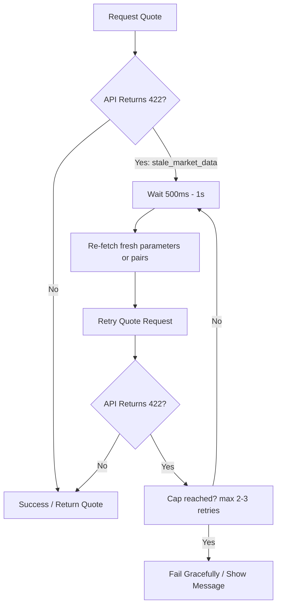

# API Integrator Error Guide

This guide helps integrators handle StellarRoute API errors in production clients, SDKs, and UIs. It provides practical recommendations on retry semantics, backoff strategies, client-side caching, and user presentation.

## Retry vs fail-fast matrix

The following matrix defines the recommended retry strategy for each standard API error code (both REST and WebSocket).

| Error code | HTTP status | Action | Retry guidance |
|:---|:---|:---|:---|
| `bad_request` | 400 | Fail fast | Do not retry; the payload format, structure, or content type is invalid. |
| `invalid_asset` | 400 | Fail fast | Do not retry; validate asset format (`CODE:ISSUER` or `native`) before resubmitting. |
| `validation_error` | 400 | Fail fast | Do not retry; present validation details to the user and request updated inputs. |
| `unauthorized` | 401 | Fail fast | Do not retry automatically; check credentials, API key, or prompt wallet connection. |
| `not_found` | 404 | Fail fast | Do not retry; the requested resource (pair, orderbook, etc.) does not exist. |
| `no_route` | 404 | Fail fast / Wait | Do not retry immediately; no trade path exists between the assets. Wait for orderbook updates. |
| `stale_market_data` | 422 | Retry with refresh | Refresh quote parameters and retry after a short delay (e.g. 500ms - 1s). See [Handling stale_market_data](#handling-stale_market_data). |
| `rate_limit_exceeded` | 429 | Retry with backoff | Retry after the delay specified in `Retry-After` header or using exponential backoff. |
| `overloaded` | 503 | Retry with backoff | Wait and retry with exponential backoff. Cap at 3–4 attempts, then fall back to a failure state. |
| `internal_error` | 500 | Retry carefully | Retry once or twice with brief delay for transient server errors; otherwise fail fast. |
| `unknown_action` (WS) | N/A | Fail fast | Do not retry; check the subscription message action name. |
| `invalid_subscription` (WS) | N/A | Fail fast | Do not retry; check required subscription fields. |
| `too_many_subscriptions` (WS) | N/A | Fail fast / Limit | Stop subscribing. Close inactive connections or subscriptions before opening new ones. |

---

## Recommended backoff strategy

### `rate_limit_exceeded`

The API rate limiter protects the routing service and indexers. When rate limits are reached, the API returns a `429 Too Many Requests` status code and standard rate-limiting headers.

- **`Retry-After` Header**: If the response contains a `Retry-After` header, clients should respect it. It indicates the duration (in seconds) or the date-time to wait before retrying.
- **`X-RateLimit-*` Headers**:
  - `X-RateLimit-Limit`: Maximum requests allowed in the window.
  - `X-RateLimit-Remaining`: Requests remaining in the current window.
  - `X-RateLimit-Reset`: Unix timestamp (epoch seconds) indicating when the window resets.
- **Exponential Backoff**: If no explicit delay is provided in headers, implement a backoff schedule (e.g., `1s`, `2s`, `4s`) with small random jitter to avoid retry storms.
- **Retry Cap**: Limit automatic retries to 3 attempts. If the rate limit continues to be exceeded, notify the user.

### `overloaded`

An `overloaded` (503) error indicates the backend is experiencing high transaction load, database lock congestion, or indexer lag.

- Treat this as temporary system backpressure.
- Implement exponential backoff beginning at `1s`, increasing to `2s` and `4s`.
- Cap retries at 3–4 attempts to prevent exacerbating server load.
- If retries fail, degrade gracefully by showing a "high traffic" banner or disabling live updates.

### `internal_error`

An `internal_error` (500) indicates an unhandled server error.

- Assume it is transient but dangerous to retry aggressively.
- Perform a single retry after `500ms`.
- If the retry fails, fail fast and log the response error details for diagnostics.

---

## Handling `stale_market_data`

The `stale_market_data` (422) error indicates that the underlying orderbook depth or Soroban pool reserves have not been updated within the allowed freshness window (e.g., due to indexer latency or blockchain delay).

To handle this cleanly in your client:



### Stale Market Data Integration Pattern
1. **Detect**: Catch `stale_market_data` from the API or via SDK convenience helper `err.isStaleMarketData()`.
2. **Backoff**: Wait `500ms` to `1s` to give the background indexer time to catch up and ingest the latest ledger close.
3. **Parameter Refresh**: Optional but recommended—refetch the source assets/pairs configurations to ensure the swap parameters are still correct.
4. **Retry**: Resubmit the quote request.
5. **Circuit Breaker**: Cap retries at `2` or `3` attempts. If it continues to fail, surface an action block to the user so they can adjust their inputs or choose a different pair.

---

## JS SDK examples

The JavaScript SDK (`@stellarroute/sdk-js`) wraps HTTP errors in a helper `StellarRouteApiError` class.

```ts
import {
  StellarRouteClient,
  StellarRouteApiError,
  isStellarRouteApiError,
} from '@stellarroute/sdk-js';

const client = new StellarRouteClient({
  baseUrl: 'https://api.stellarroute.io',
  timeoutMs: 10000,
  retries: 2, // Automatic retries on 429 and 5xx
});

try {
  // Option A: Raw quote request
  const quote = await client.getQuote('native', 'USDC', 100);
  console.log(`Quote received: ${quote.price}`);
  
  // Option B: Quote request with client-side expiration/staleness validation
  const validQuote = await client.getQuoteWithValidation(
    'native',
    'USDC',
    100,
    'sell',
    50, // 0.5% slippage
    { max_age_seconds: 15, reject_stale: true }
  );
} catch (err) {
  if (!isStellarRouteApiError(err)) {
    console.error('Non-API or network error:', err);
    throw err;
  }

  // Branch on type of error using SDK convenience helpers
  if (err.isNotFound()) {
    console.warn('Pair not found or asset is unsupported.');
  } else if (err.isValidationError()) {
    console.warn('Invalid input arguments:', err.message, err.details);
  } else if (err.isStaleMarketData()) {
    console.warn('Stale market data, initiating refresh and retry loop...');
    // Handle stale market data retry flow...
  } else if (err.isRateLimited()) {
    console.warn(`Rate limit exceeded (HTTP 429).`);
  } else if (err.isOverloaded()) {
    console.warn('Service overloaded. Please retry in a few seconds.');
  } else if (err.isNetworkError()) {
    console.error('Failed to reach the server. Check your internet connection.');
  } else if (err.code === 'quote_expired') {
    console.warn('The generated quote has expired.');
  } else if (err.code === 'quote_stale') {
    console.warn('Client-side staleness detection rejected the quote.');
  } else {
    console.error(`API error [${err.code}]: ${err.message}`);
  }
}
```

### Useful JS SDK helpers
- `err.isNotFound()` — returns `true` for `404` / `not_found`
- `err.isValidationError()` — returns `true` for `400` / `validation_error` or `invalid_asset`
- `err.isRateLimited()` — returns `true` for `429` / `rate_limit_exceeded`
- `err.isOverloaded()` — returns `true` for `503` / `overloaded`
- `err.isStaleMarketData()` — returns `true` for `422` / `stale_market_data`
- `err.isNetworkError()` — returns `true` for network-level transport failure / timeout (status `0`)

---

## Rust SDK examples

The Rust SDK (`stellarroute-sdk`) returns a typed `Result<T, SdkError>` and defines convenience functions for error mapping.

```rust
use std::time::Duration;
use stellarroute_sdk::{ApiErrorCode, ClientBuilder, QuoteRequest, QuoteType, SdkError};

#[tokio::main]
async fn main() {
    let client = ClientBuilder::new("http://localhost:3000")
        .timeout(Duration::from_secs(10))
        .max_retries(3) // Auto retries on 429 and 5xx
        .build()
        .unwrap();

    let request = QuoteRequest {
        base: "native".to_string(),
        quote: "USDC".to_string(),
        amount: Some("100"),
        quote_type: QuoteType::Sell,
    };

    match client.quote(request).await {
        Ok(quote) => println!("Executable price: {}", quote.price),
        Err(err) => {
            // Option 1: Match directly on SdkError variants
            match &err {
                SdkError::InvalidConfig(msg) => eprintln!("Config error: {}", msg),
                SdkError::Http(msg) => eprintln!("Transport failure: {}", msg),
                SdkError::Deserialization(json_err) => eprintln!("Failed parsing JSON: {}", json_err),
                SdkError::RateLimited { info } => {
                    eprintln!("Rate limited. Reset at: {:?}", info.reset);
                }
                SdkError::Api { code, message, status } => {
                    eprintln!("API Error [{} / HTTP {}]: {}", code, status, message);
                }
            }

            // Option 2: Use SDK convenience boolean helpers
            if err.is_not_found() {
                eprintln!("Pair or route not found");
            } else if err.is_validation_error() {
                eprintln!("Input parameters validation failed");
            } else if err.is_stale_market_data() {
                eprintln!("Market data is stale. Please wait and try again.");
            } else if err.is_overloaded() {
                eprintln!("Backend is overloaded. Backing off...");
            }
        }
    }
}
```

### Rust SDK convenience helpers
- `err.is_not_found()` — maps to `ApiErrorCode::NotFound`
- `err.is_validation_error()` — maps to `ApiErrorCode::ValidationError` or `ApiErrorCode::InvalidAsset`
- `err.is_rate_limited()` — maps to `SdkError::RateLimited`
- `err.is_stale_market_data()` — maps to `ApiErrorCode::StaleMarketData`
- `err.is_overloaded()` — maps to `ApiErrorCode::Overloaded`
- `err.is_transport()` — maps to `SdkError::Http`

---

## Sample JSON error responses

### `bad_request` (HTTP 400)
```json
{
  "error": "bad_request",
  "message": "Malformed request syntax or structure"
}
```

### `invalid_asset` (HTTP 400)
```json
{
  "error": "invalid_asset",
  "message": "Invalid asset identifier format",
  "details": {
    "asset": "USDC:INVALID_ISSUER_G_ADDRESS"
  }
}
```

### `validation_error` (HTTP 400)
```json
{
  "error": "validation_error",
  "message": "Amount must be a positive decimal string",
  "details": {
    "field": "amount",
    "reason": "must be greater than zero"
  }
}
```

### `unauthorized` (HTTP 401)
```json
{
  "error": "unauthorized",
  "message": "The request lacks valid authentication credentials"
}
```

### `not_found` (HTTP 404)
```json
{
  "error": "not_found",
  "message": "Trading pair not found"
}
```

### `no_route` (HTTP 404)
```json
{
  "error": "no_route",
  "message": "No executable route found for this asset pair at the requested trade size"
}
```

### `stale_market_data` (HTTP 422)
```json
{
  "error": "stale_market_data",
  "message": "Pricing data is stale",
  "details": {
    "last_updated": "2026-07-01T09:40:00Z",
    "threshold_seconds": 30
  }
}
```

### `rate_limit_exceeded` (HTTP 429)
```json
{
  "error": "rate_limit_exceeded",
  "message": "Too many requests sent in a short period",
  "details": {
    "retry_after_seconds": 15
  }
}
```

### `overloaded` (HTTP 503)
```json
{
  "error": "overloaded",
  "message": "Service is under heavy load. Please retry later."
}
```

### `internal_error` (HTTP 500)
```json
{
  "error": "internal_error",
  "message": "Unexpected server failure"
}
```

### WebSocket `unknown_action`
```json
{
  "error": "unknown_action",
  "message": "The action 'unsubscribe_all' is not supported"
}
```

### WebSocket `invalid_subscription`
```json
{
  "error": "invalid_subscription",
  "message": "Subscription payload is missing 'base_asset'",
  "details": {
    "required_fields": ["base_asset", "counter_asset"]
  }
}
```

### WebSocket `too_many_subscriptions`
```json
{
  "error": "too_many_subscriptions",
  "message": "Connection has reached the limit of 50 active subscriptions"
}
```

---

## Versioning and deprecation headers interaction

When working with deprecated routes or versions, the API responds with standard metadata headers alongside standard payloads or error codes:

1. **`Deprecation` Header**: Returns `true` if the requested route or API version is marked for deprecation.
2. **`Sunset` Header**: Provides the RFC 7231 date-time when the route or API version will be turned off and become unsupported.
3. **`Link` Header**: Contains the successor version path or a link to migration instructions (e.g. `<successor_url>; rel="successor-version", <migration_guide>; rel="deprecation"`).

### Deprecation Sunset Errors
Once the `Sunset` deadline passes, requests targeting deprecated endpoints or versions will **fail fast** and return:
- An HTTP status `404 Not Found` with the `not_found` error code.
- Or an HTTP status `400 Bad Request` with the `bad_request` error code (if the major API version path is entirely unsupported).

Integrators should track these headers in client middleware to trigger warning logs or schedule dependency updates. See [API Versioning and Deprecation Policy](versioning-policy.md) for details.

---

## Frontend guidance and trader-facing copy

If you are developing user interfaces, you should **never** show raw API error codes (e.g., `stale_market_data` or `validation_error`) to traders.

Instead, map each error code to consistent, actionable trader-facing copy using the guidelines in the [Trader-Facing Error Copy and Tone Style Guide](../../frontend/docs/trader-error-copy-style-guide.md).

### Quick copy reference:
- **`validation_error`**: *Check your trade details* — One or more inputs are outside the allowed format or range. (CTA: Review trade inputs)
- **`invalid_asset`**: *This asset pair is not available right now* — The selected asset format or issuer could not be matched. (CTA: Select another pair)
- **`no_route`**: *No executable route found* — Current liquidity cannot complete this trade at the requested size. (CTA: Adjust trade size)
- **`stale_market_data`**: *Market data is still updating* — Fresh pricing is not available yet for this route. (CTA: Refresh in a few seconds)
- **`rate_limit_exceeded`**: *Quote refresh is temporarily limited* — Too many quote requests were sent in a short window. (CTA: Try again shortly)
- **`overloaded`**: *Quote service is handling high traffic* — Routing services are taking longer than normal to respond. (CTA: Retry quote)
- **`unauthorized`**: *Session check required* — Your current request needs a valid session context. (CTA: Reconnect wallet)
- **`not_found`**: *Requested market data was not found* — The selected pair or route data is currently unavailable. (CTA: Choose another pair)
- **`internal_error`**: *Quote service hit an internal issue* — The request reached the server but could not be completed safely. (CTA: Retry quote)
- **`network_error`**: *Network connection interrupted* — The app could not reach routing services from this device. (CTA: Reconnect and refresh)

In the Next.js frontend, this translation is implemented dynamically via `getTraderErrorCopy` in [trader-error-copy.ts](../../frontend/lib/api/trader-error-copy.ts).
