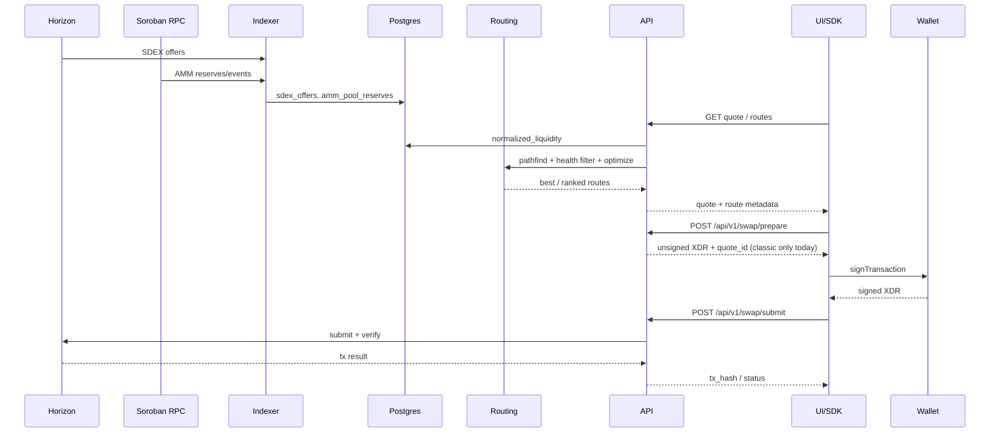

# StellarRoute — Technical Architecture (SCF)

**Purpose:** Self-contained architecture reference for Stellar Community Fund reviewers and for coding agents working on the funded mainnet path.  
**Track:** Open Track (net-new aggregation / routing primitive on Stellar).  
**Repo:** https://github.com/StellarRoute/StellarRoute  
**Product UI:** https://stellarroute.app  
**Related diagrams:** [`diagrams.md`](./diagrams.md) · Schema: [`database-schema.md`](./database-schema.md)

This document is **Stellar-specific**: Horizon (classic SDEX), Soroban RPC (AMM state + contracts), non-custodial wallet signing, and settlement on the Stellar network.

---

## Human readable summary

### What we are building

StellarRoute is a **non-custodial** DEX aggregation platform centered on Stellar. Users keep their keys and assets. StellarRoute discovers liquidity, computes best-price routes, prepares transactions for the user to sign, and helps submit/verify settlement — without ever holding funds.

On Stellar today, traders face **fragmented liquidity**: the classic **SDEX orderbook** and multiple **Soroban AMM pools** do not share one price surface. Wallets and dApps that only look at one venue leave money on the table. StellarRoute indexes both, routes across them, and exposes that capability to humans (web UI) and machines (REST, WebSocket, JS/Rust SDKs).

### How it fits the Stellar stack

| Stellar building block | How StellarRoute uses it |
| --- | --- |
| **Horizon** | Index classic SDEX offers; submit/confirm classic path-payment swaps |
| **Soroban RPC** | Index AMM pool reserves/events; target for router contract calls |
| **Classic transactions** | Live testnet execution via `PathPaymentStrictSend` (user signs in wallet) |
| **Soroban contracts** | Testnet router deployed (`validate` / `quote` / `execute`); mainnet gated on audit |
| **Wallets** | Freighter, xBull, Albedo, LOBSTR — user signs; API never holds secrets |
| **USDC / CCTP (testnet proven)** | Signed-live Stellar → Sepolia USDC mint proven; public API execution still fail-closed (`CCTP_ENABLED=false` by default) until ops enablement |

### System in one picture

```text
  Horizon (SDEX) ──┐
                   ├──► Indexer (Rust) ──► PostgreSQL ──► Routing engine
  Soroban RPC ─────┘         │                              │
                             │                              ▼
                             │                    API (Axum) + Redis
                             │                         │
                             │            ┌────────────┼────────────┐
                             │            ▼            ▼            ▼
                             │     Next.js UI    JS / Rust SDKs   Ops/metrics
                             │            │
                             │            ▼
                             └──► User wallet signs ──► Stellar Network
                                  (classic today; Soroban after audit)
```

### What works today (honest)

- **Indexing:** Live sync of SDEX offers and Soroban AMM reserves into a unified `normalized_liquidity` read model.
- **Quotes & routes:** Multi-hop pathfinding, ranked routes, price impact, venue freshness/health filters, kill-switch and canary controls.
- **Live swaps (testnet):** Classic **one-hop SDEX** prepare → wallet sign → submit. Production UI on Vercel; staging API on always-on public HTTPS.
- **Contracts:** Soroban router on testnet with a documented public interface.
- **Integrators:** OpenAPI, WebSocket quotes, `@stellarroute/sdk-js`, Rust SDK/CLI.

### What SCF funding is for (to be added / improved)

Funding is aimed at closing the gap between “best price **discovered**” and “best price **settled on mainnet**”:

1. **Soroban execution path** — prepare/submit (or equivalent) for AMM / multi-hop routes through the audited router, not only classic path-payment.
2. **Full aggregation settlement** — execute the routes the optimizer already finds (multi-hop, AMM venues), with slippage and safety guards on-chain.
3. **Security & mainnet** — external Soroban audit, remediation, gradual mainnet rollout (limited pairs → broader markets).
4. **Cross-chain foundation (gated)** — Circle CCTP Stellar ↔ Sepolia USDC is **signed-live proven on testnet in both directions** (see `docs/cctp/signed-live-stellar-to-sepolia.md` and `docs/cctp/signed-live-sepolia-to-stellar.md`); keep public enablement gated on attestation/readiness probes; still non-custodial.
5. **Product hardening** — ops SLOs, load evidence, wallet UX, integrator docs so wallets/dApps can rely on the API.

Longer horizon (beyond the immediate Build Award window): Stellar as the hub for swap → bridge → offramp in one non-custodial financial application — using **existing** settlement rails, not inventing a proprietary bridge.

### Non-custodial guarantee (product rule)

- Private keys never leave the user’s wallet.
- The API may prepare unsigned (or partially assembled) XDR and verify signatures / on-chain outcomes.
- No pooled user deposits; no “StellarRoute custody account” in the hot path.

### Why this is Open Track

StellarRoute is not only an app glued to one existing protocol. It introduces an **open aggregation primitive**: unified SDEX+AMM liquidity index, routing/optimizer, server-authoritative prepare/submit, Soroban router interface, and SDKs so the whole ecosystem can reuse best-price discovery.

---

## Fully detailed summary (best for coding agents)

### 0. Agent operating constraints

- **Source of truth for live swap scope:** classic one-hop SDEX only unless code + readiness docs say otherwise. Do not claim AMM/multi-hop prepare is live.
- **Mainnet:** blocked on external Soroban audit (`audit/external-audit.md`). Do not flip mainnet execution casually.
- **CCTP:** `/api/v2/bridge/cctp/*` exists; default `CCTP_ENABLED=false`. **Testnet signed-live:** Stellar → Sepolia destination mint [`0x713cc8b1…bed6`](https://sepolia.etherscan.io/tx/0x713cc8b174d775bf7a3a97f33c53a37f698c93bc66b378dfa55ccfcc7f1cbed6) (2026-08-14, 25 USDC). Stellar burn is two-step (`approve` then `deposit_for_burn`); `submit-burn` must classify on-chain function (never treat approval txs as burns).
- **Roadmap.md milestones M3–M5 are stale** relative to the tree; prefer this doc + readiness checklists + code.
- **Order splitting across venues** is not a shipped product feature; “partial fills” in impact math means walking multiple SDEX book levels, not splitting one trade across AMMs.
- Workspace layout: Rust workspace under `crates/*`, UI under `frontend/`, TS SDK under `sdk-js/`.

### 1. Repository map

| Path | Role |
| --- | --- |
| `crates/indexer` | Horizon SDEX + Soroban AMM ingestion → Postgres |
| `crates/routing` | Pathfinder, hybrid optimizer, impact, health/freshness/anomaly, risk, canary, cross-chain stubs |
| `crates/api` | Axum REST + WebSocket; quote/routes/swap; CCTP v2; admin kill-switch/canary |
| `crates/contracts` | Soroban router + AMM adapters + governance/upgrade |
| `crates/sdk-rust` | Rust HTTP client + CLI |
| `sdk-js` | TypeScript client (`prepareSwap` / `submitSwap` / `cctp*`) |
| `frontend` | Next.js App Router UI (swap, orderbook, guide, status, CCTP UI gated by API) |
| `docs/` | Architecture, API, contracts, deployment, readiness, runbooks |
| `deploy/` | Prod compose, Oracle Always Free runbooks |
| `config/deployments/testnet.json` | Deployed testnet router address + metadata |
| `audit/` | External audit package / launch gate notes |

### 2. Runtime data flow (executable mental model)



**Quote path (code):** `crates/api/src/routes/quote.rs` loads candidates from `normalized_liquidity`, applies `stellarroute-routing::health::*` filters/scorers, selects best executable venue / ranked routes.

**Swap path (code):** `crates/api/src/routes/swap.rs` — prepare/submit; rejects AMM and multi-hop with `unsupported_execution_mode` / `unsupported_route`.

### 3. Stellar integration surface (concrete)

#### 3.1 Indexer

- **Binary:** `stellarroute-indexer` (`crates/indexer`).
- **SDEX loop:** Horizon offers → `sdex_offers` (`sdex.rs`, `horizon.rs`); polling/streaming dual mode.
- **AMM loop:** Soroban pool state/events → `amm_pool_reserves` (`amm.rs`, `soroban.rs`).
- **Required env:** `DATABASE_URL`, `STELLAR_HORIZON_URL`, `SOROBAN_RPC_URL`, `ROUTER_CONTRACT_ADDRESS`.
- **Ops:** dedup, reconciliation/backfill, partitioning, lag monitoring (`docs/indexer-lag-monitoring.md`, `WORKER_POOL.md`, `RECONCILIATION.md`).

#### 3.2 Unified liquidity model

View `normalized_liquidity` unions SDEX + AMM into:

- `venue_type` (`sdex` | `amm`)
- `venue_ref` (offer id | pool contract)
- `selling_asset_id` / `buying_asset_id`
- `price`, `available_amount`, `source_ledger`, `updated_at`

Details: `docs/architecture/database-schema.md`.

#### 3.3 Routing engine (`crates/routing`)

| Module area | Behavior |
| --- | --- |
| `pathfinder` | Multi-hop graph search; configurable `max_hops` |
| `optimizer` | Hybrid ranking (output, impact, latency) — see `docs/hybrid_optimizer.md` |
| `impact` | SDEX book walk + AMM constant-product impact |
| `health/*` | Freshness thresholds, filters, scorers, anomaly, circuit breaker, policy |
| `risk` / `consensus` / `canary` / `adaptive_routing` | Limits, canary promotion, kill-switch integration |
| `cross_chain` / `chain_asset` | CAIP-style assets; bridge edges **non-executable by default** in pathfinding |

M2 readiness gates (pathfind latency, multi-hop, AMM models): `docs/readiness/M2_GUIDE.md`.

#### 3.4 API (`crates/api`)

**Market / routing (v1):**

- `GET /api/v1/pairs`, `GET /api/v1/markets`
- `GET /api/v1/orderbook/:base/:quote`, batch orderbook
- `GET /api/v1/quote/:base/:quote`, `POST /api/v1/quote`, batch quote
- `GET /api/v1/routes/:base/:quote` (ranked)
- `POST /api/v1/simulate/route`
- `GET /api/v1/price-history/:base/:quote`, assets, activity
- `GET /ws` — quote stream (`docs/api/websocket.md`)

**Live swap (v1) — current contract:**

- `POST /api/v1/swap/prepare`
- `POST /api/v1/swap/submit`
- Scope: **classic `PathPaymentStrictSend`, single hop**, `execution_mode: classic_path_payment`
- Sender lock: at most one active prepared/submitting quote per sender (`docs/runbooks/swap-submitting-sender-lock.md`)

**v2 / CCTP:**

- `GET /api/v2`, `POST /api/v2/assets/canonicalize`
- `/api/v2/bridge/cctp/*` — quote, prepare/submit burn & mint, status, reattest (`docs/api/cctp-v2-contract.md`)
- Public execution gated; see `docs/cctp/stellar-verifier-blockers.md`

**Safety / ops:** `/health`, `/health/deps`, Prometheus metrics, admin kill-switch, canary, cache flush, replay.

#### 3.5 Soroban router (`crates/contracts`)

Public interface (stable aliases):

- `validate(route) -> Result<(), ContractError>`
- `quote(amount_in, route) -> Result<QuoteResult, ContractError>`
- `execute(sender, params) -> Result<SwapResult, ContractError>`

Auth: `execute` requires `sender.require_auth()`. Events: `rt_val`, `quote`, `exe_req`, `swap`, `exe_fail` under topic prefix `"StellarRoute"`.

AMM hops assume pool adapters exposing roughly `adapter_quote` / `swap` / `get_rsrvs` (CCI adapter layer). Full detail: `docs/contracts/router-interface.md`.

**Testnet deployment:** recorded in `config/deployments/testnet.json` (router `C…` address; deployed 2026-07-28). **API live path does not yet settle via this contract.**

#### 3.6 Frontend & wallets

- Routes: `/`, `/swap`, `/orderbook`, `/history`, `/settings`, `/status`, `/guide`, analytics/inspector (feature-flagged).
- Stellar wallets: Freighter (`isConnected()`), xBull, Albedo, LOBSTR — `docs/development/wallet-integration.md`.
- Live execution flag: `real_xdr` (default on; security-pinned) → `frontend/lib/swap/api-execution.ts`.
- Multi-chain wallet adapters exist for the cross-chain foundation; Stellar remains the settlement center of gravity.

#### 3.7 SDKs

- **JS:** `@stellarroute/sdk-js` — quotes, ranked routes, simulate, prepare/submit/execute/confirm, CCTP methods.
- **Rust:** `stellarroute-sdk` + CLI.

### 4. Deployment architecture (Wave 0 / SCF-relevant)

| Surface | Reality |
| --- | --- |
| Frontend | Vercel; `stellarroute.app` / `www.stellarroute.app`; root dir `frontend/` |
| Network default | Testnet for Wave 0 / production UI |
| Staging API | Oracle Always Free ARM + Cloudflare Tunnel; hostname documented in `docs/deployment/oracle-always-free.md` / AGENTS.md (`*.sslip.io`) |
| Stack | API + indexer + Postgres + Redis via `deploy/docker-compose.prod.yml` |
| CI | GitHub Actions: lean Rust gates, frontend Vitest splits, gas benchmarks, staging smoke, deploy-testnet (never mainnet from that path) |

### 5. Security & control plane

- **Non-custodial prepare/submit** with signature verification and bound `tx_hash` claim before broadcast.
- **Kill switch** — `docs/RUNBOOK_KILL_SWITCH.md`.
- **Routing canary** — `docs/routing_canary.md`.
- **Quote purger / TTLs** — quote lifecycle ops docs.
- **Gradual rollout** — limited pairs → full markets: `docs/deployment/gradual-rollout-plan.md`.
- **Audit gate** — mainnet flag off until external Soroban audit Critical/High remediated.

### 6. SCF-funded work breakdown (architecture deltas)

Agents implementing funded milestones should treat these as the **intended architecture changes**, not aspirational marketing:

| Tranche theme | Architecture change | Primary code surfaces | Exit criteria (verifiable) |
| --- | --- | --- | --- |
| T0/T1 — Complete Stellar aggregation core | Keep indexer+routing; expand **executable** venues | `crates/api` swap prepare/submit; `crates/routing`; frontend execution | Multi-hop and/or AMM routes prepare successfully on testnet with wallet sign + on-chain success evidence |
| Soroban settlement | Wire API execution_mode → router `execute` | `crates/api`, `crates/contracts`, wallet XDR/Soroban auth | E2E checklist sibling to classic checklist; `execution_mode` documents Soroban |
| Security | External audit + fix | `crates/contracts`, `audit/` | Audit report + remediated findings; mainnet config reviewed |
| Mainnet | Network flags, pool/token allowlists, gradual pairs | `config/*`, deploy, frontend network banner | Limited-pair mainnet swaps with monitoring/rollback |
| CCTP enablement | Flip public readiness after verifiers; signed-live Stellar↔Sepolia proven both ways; staging checklist ready | `crates/api/src/cctp/*`, `frontend/lib/cctp/*`, `docs/deployment/cctp-staging-enablement-checklist.md` | Operator `CCTP_ENABLED` with attestation proofs; burn≠approve classification enforced |
| Integrator surface | Stable OpenAPI + SDK examples | `docs/api`, `sdk-js` | Integrator can quote→prepare→submit without reading internal runbooks |

Suggested payment mapping (SCF four tranches ~10/20/30/40%): align budget narrative to the table above in the application form; keep each tranche’s deliverable **demoable on Stellar**.

### 7. Explicit non-goals (near term)

- Building a new bridge protocol (use CCTP/anchors/intents instead).
- Custodial balances or pooled trader funds.
- Claiming venue order-splitting or mainnet trading before gates clear.
- Replacing Horizon/Soroban — we **consume** them as sources of truth.

### 8. Performance & quality bars (existing)

- API target: sub-500ms quote/routes p95 budget (`docs/performance_budget.md`).
- Pathfinder / optimizer baselines: `docs/baseline_report.json`, routing benches CI.
- Contract gas budgets: `docs/contracts/gas-benchmarks.md`.
- Classic live swap proof procedure: `docs/readiness/live-swap-testnet-checklist.md`.
- CCTP signed-live Stellar → Sepolia: `docs/cctp/signed-live-stellar-to-sepolia.md`.
- CCTP reverse Sepolia → Stellar (signed-live): `docs/cctp/signed-live-sepolia-to-stellar.md`.
- CCTP staging enablement: `docs/deployment/cctp-staging-enablement-checklist.md`.

### 9. Quick commands (agent cheat sheet)

```bash
# Deps
docker-compose up -d
./scripts/wait-for-services.sh --api

# Rust
cargo run -p stellarroute-api
cargo run -p stellarroute-indexer
cargo test -p stellarroute-api --lib

# Frontend
npm --prefix frontend install
npm --prefix frontend run dev

# SDK
npm --prefix sdk-js run test
```

### 10. Doc index for deeper dives

| Topic | Doc |
| --- | --- |
| Diagrams | `docs/architecture/diagrams.md` |
| Schema | `docs/architecture/database-schema.md` |
| Swap E2E UX | `docs/swap-e2e-flow.md` |
| Classic live checklist | `docs/readiness/live-swap-testnet-checklist.md` |
| Router interface | `docs/contracts/router-interface.md` |
| CCTP API contract | `docs/api/cctp-v2-contract.md` |
| CCTP signed-live proof (forward) | `docs/cctp/signed-live-stellar-to-sepolia.md` |
| CCTP signed-live proof (reverse) | `docs/cctp/signed-live-sepolia-to-stellar.md` |
| Oracle staging | `docs/deployment/oracle-always-free.md` |
| Vercel frontend | `docs/deployment/vercel-frontend.md` |
| Integrator guide | `docs/api/integrator-guide.md` |

---

*Last aligned to codebase capability model used for SCF Open Track (testnet classic execution live; CCTP Stellar↔Sepolia signed-live proven both ways on testnet; Soroban/public CCTP enablement/mainnet gated). Update this file when execution_mode scope expands.*
