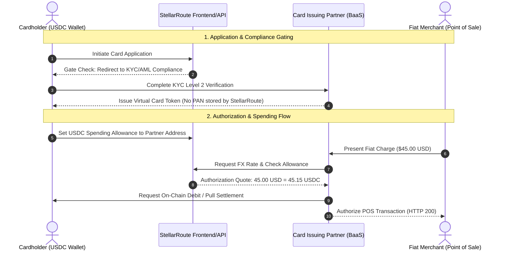

# Stablecoin Debit Contract: Fiat Merchant Charge & USDC Balance

> **Sequence:** `CARD-01` of `AI-01 → AI-50`, then `CARD-01 → CARD-50`  
> **Prerequisite:** `AI-50` — card track starts after the autonomous agent sequence  
> **Additive Scope:** Additive-only. Zero modification to live `/swap`, `/offramp`, or `/cross-chain-swap` paths.  
> **Flag Gate:** `CARD_ENABLED` (Default: `false` / unset). All card capabilities remain dormant when unset.

---

## 1. Overview & Architectural Role

StellarRoute users hold balances in self-custodied stablecoins (principally **USDC** on Stellar). International physical and online merchants, however, invoice transactions in local fiat currencies (**USD, EUR, GBP, NGN, KES**, etc.).

Because StellarRoute maintains an offramp for selected corridors (e.g., NGN) but does not operate as a licensed depository institution, **StellarRoute does not operate a direct debit card program**. Instead:
1. The debit card is an external **partner instrument** issued by a licensed Card-as-a-Service (BaaS) and card-issuing partner.
2. The user holds their spending balance directly in **USDC on Stellar**.
3. Settlement occurs via an authorized cryptographic allowance / debit authorization signed by the user toward the partner's designated Stellar settlement address.

---

## 2. Invariants & Regulatory Demarcation

To preserve regulatory compliance and security posture:

### A. Strict Dual-Amount Naming (USDC Balance vs. Fiat Charge)
Every authorization, webhook, receipt, and display artifact must treat the two currency figures as independent, distinct entities:
* **`usdc_balance` / `usdc_charge`**: The exact quantity of USDC on the Stellar ledger (e.g., `45.1500000 USDC`).
* **`fiat_charge` / `fiat_amount`**: The local merchant currency amount and currency code requested at the terminal (e.g., `45.00 USD`, `39.50 EUR`, `18,500 NGN`).

Quotes must always state the effective exchange rate, slippage bound, and any partner servicing fee explicitly without collapsing the two figures into an ambiguous single total.

### B. No BIN Issuance & No Spending Float Custody
* **No BIN Ownership**: StellarRoute **does not issue a Bank Identification Number (BIN)**. BIN ranges are owned, routed, and managed exclusively by the partner issuing bank under Visa/Mastercard network rules.
* **No Float Custody**: StellarRoute **does not hold user spending float**. Funds remain in the user's non-custodial Stellar account until settlement or are deposited directly into the regulated partner's escrow account. StellarRoute never commingles or custodies fiat or stablecoin card deposits.

### C. Zero Knowledge of Cardholder Credentials (No PAN or CVV Storage)
* StellarRoute infrastructure **never touches, processes, logs, or stores** Primary Account Numbers (PAN), Card Verification Values (CVV/CVC), or card expiration dates.
* Card credential presentation (virtual card display, Apple Pay / Google Pay tokenization) is handled via PCI-DSS Level 1 compliant iframes and SDKs provisioned directly by the card-issuing partner.

---

## 3. Compliance Gates: Mandatory KYC & AML Verification

No card instrument may be provisioned or activated without verified compliance checks. 

Before an application payload is forwarded to the partner or accepted by the API, the user must satisfy the verified compliance standards set forth in:
* [`docs/compliance/kyc-policy.md`](file:///home/forger/Desktop/Projects/Special/docs/compliance/kyc-policy.md) — Customer Due Diligence (CDD), identity document verification, liveness verification, and biometric matching.
* [`docs/compliance/aml-risk-scoring.md`](file:///home/forger/Desktop/Projects/Special/docs/compliance/aml-risk-scoring.md) — Sanctions screening (OFAC, UN, EU), Politically Exposed Persons (PEP) checks, and wallet risk scoring against high-risk mixers or flagged addresses.

Any unverified account attempting to access `/api/v1/card/apply` or request authorization configurations will be rejected with `403 Forbidden` (`COMPLIANCE_KYC_REQUIRED`).

---

## 4. Allowance & Authorization Lifecycle

1. **Allowance Authorization**: The user submits a signed Stellar transaction establishing an allowance or pre-funding a dedicated smart contract vault held for the partner's public key (`CARD_PARTNER_STELLAR_ADDRESS`).
2. **Merchant Pre-Authorization**: When the merchant initiates a transaction:
   - The partner queries the active FX rate.
   - The partner verifies that `usdc_balance >= usdc_quote`.
   - A temporary hold (`hold_amount`) is registered.
3. **Capture & Settlement**:
   - Upon merchant batch settlement, the partner executes or claims the exact `usdc_charge`.
   - Over-reserved balances are automatically released back to the user's available balance.
4. **Fail-Closed Default**:
   - If `CARD_ENABLED` is `false` or unset: all `/api/v1/card/*` routes return `404 Not Found`.
   - If `CARD_PARTNER_STELLAR_ADDRESS` is empty: authorizations fail closed with status `partner_unconfigured`.

---

## 5. Additive Guarantee & Zero Impact Verification

In strict accordance with the additive constraint of `CARD-01`:
1. **Production Isolation**: This documentation addition introduces no schema mutations, no breaking API changes, and no modifications to live `/swap`, `/offramp`, or `/cross-chain-swap` endpoints.
2. **Frozen Core Logic**: All SDEX swap pathways, CCTP bridge modules, and existing OpenAPI specifications remain 100% frozen and unmodified.
3. **Feature Flagging**: All downstream card routes remain gated behind `CARD_ENABLED=false` until explicit mainnet partner launch.
